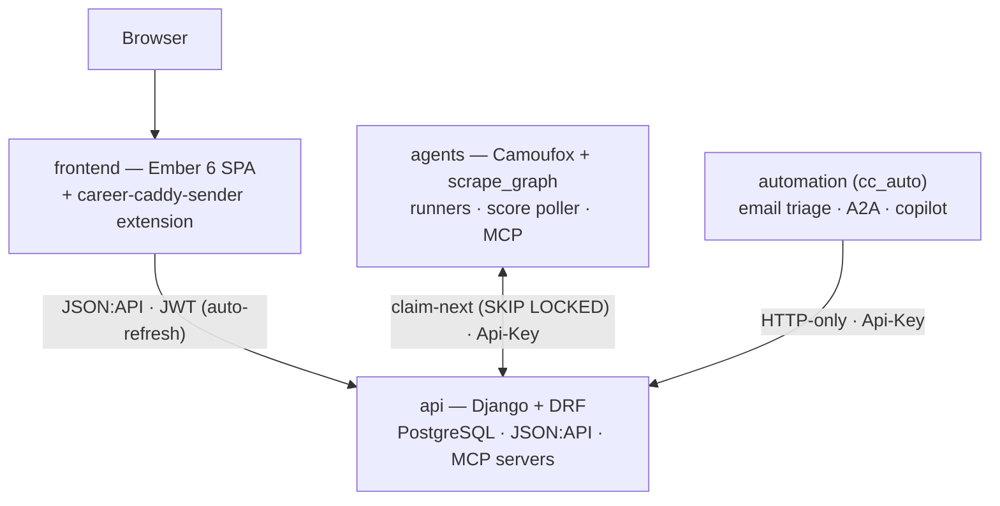

# Career Caddy

**An AI-assisted, self-hostable platform for running a job hunt end-to-end** — capture
postings from anywhere, extract and de-duplicate them, score them against your background, and
draft cover letters and application answers. It's a production, multi-service system — a web
SPA, a REST API, autonomous scraping agents, a browser extension, and an operator automation
toolkit — built as a git-submodule monorepo.

> **Core idea — Career Data is the center of everything.** You write one markdown document
> (your background, skills, writing voice, goals) and refine it over time. Every AI feature —
> scoring, cover letters, summaries, answer drafting, chat — uses it as foundational prompt
> context. Better Career Data means better output everywhere.

**Live:** [careercaddy.online](https://careercaddy.online) · **In-app docs:** `/docs` ·
**Project board:** [plans.careercaddy.dev](https://plans.careercaddy.dev)

---

## Key features

- **Send a job from anywhere** — a one-click MV3 browser extension captures the active posting
  (no password — it reuses your signed-in session); or paste the text, or submit a URL.
- **Automatic extraction & de-duplication** — pages are parsed into structured Job Posts, and
  the same role across LinkedIn, Greenhouse, Lever, etc. collapses into one canonical record.
- **AI fit scoring** — score any posting 0–100 against your Career Data so you spend effort
  where it actually counts.
- **AI cover letters & application answers** — generate and refine drafts grounded in your
  background and writing voice; favorite the good ones and they feed back into future output.
- **Posting summaries** — fast AI summaries of long job descriptions.
- **Career Data at the core** — one markdown profile (background, skills, voice, goals) that
  powers every AI feature; improve it once, improve everything.
- **Context-aware AI chat** — an SSE-streamed assistant aware of the page you're on, with
  guided-workflow prompts.
- **Resume & application tracking** — structure resumes (experience, education, skills) and
  track each application's status against its job post.
- **MCP integration & self-hostable** — expose your career tools to any MCP client (Claude
  Desktop, Cursor, …), and run the whole stack on your own infrastructure with Docker.

---

## Engineering highlights

The pieces worth a closer look:

- **Tiered, self-tuning extraction pipeline.** Each job-board domain carries a learned
  `ScrapeProfile`. The scrape graph escalates only as far as it must — **Tier 0** pure-CSS
  (BeautifulSoup, ~$0) → **Tier 1** small model → **Tier 2** Haiku → **Tier 3** Sonnet — and
  records hit/miss metrics so "known-good" domains stay on the cheap tier. Implemented as a
  **`pydantic-graph` state machine** (`agents/scrape_graph/`).
- **Distributed, race-free scrape workers.** The production VPS runs no browser. Scrapes are
  created with `status=hold`; external **runners** (a laptop, a Raspberry Pi) claim work
  atomically via `POST /api/v1/scrapes/claim-next/` using Postgres
  `SELECT FOR UPDATE SKIP LOCKED`, so N runners coexist with zero double-claims. Camoufox +
  Playwright with stealth; Chromium fallback for ARM.
- **Cross-platform JobPost de-duplication.** A LinkedIn listing and the same role on Greenhouse
  collapse into one canonical record — URL canonicalization, per-recipient tracker-link
  resolution, `apply_url`-based cross-platform matching, and a trust-aware overwrite so a
  higher-trust source upgrades a stub in place instead of creating a duplicate.
- **A browser extension that needs no password.** The MV3 `career-caddy-sender` reads your
  existing signed-in SPA session, mints a scoped, revocable API key, and one-click sends the
  active job page. A "known-good" fast path POSTs the pre-extracted title/company/description
  straight to persistence (skipping the server-side browser entirely); otherwise it falls back
  to text ingestion. Includes a staff-only tools tab gated on the server's `is_staff`.
- **MCP-native AI layer.** Agents are `pydantic-ai` definitions wired to **Model Context
  Protocol** servers; the public server is exposed at `mcp.careercaddy.online/mcp` for any MCP
  client (Claude Desktop, Cursor, …). The product's own capabilities — job posts, scrapes,
  scoring, dedupe — are themselves MCP tools.
- **SSE that survives a synchronous app server.** Long-lived event streams run on a
  **standalone uvicorn/Starlette ASGI process**, isolated from the synchronous gunicorn pool so
  a multi-minute stream can't trip the worker-timeout SIGKILL.
- **ActivityPub federation (phased).** Companies and job posts are addressable as ActivityPub
  actors — webfinger, inbox/outbox, followers — for cross-instance distribution.
- **Real-browser deploy canary + reproducible CI.** A Cypress canary hits the live public
  surface (reverse-proxy routing, migrations, certs) as a pre-push gate. CI — lint + tests for
  API / frontend / automation plus a security pass — runs through **Dagger**, so it's identical
  on a laptop and in GitHub Actions.

---

## Architecture



Five independently deployable submodules (each has its own `CLAUDE.md`):

| Submodule | Stack | Role |
|-----------|-------|------|
| `frontend/` | Ember.js 6 + Ember Data + Tailwind | JSON:API client SPA; also ships the `career-caddy-sender` browser extension |
| `api/` | Django + DRF + PostgreSQL | Domain models, extraction + dedupe, AI orchestration, JSON:API + the production MCP servers |
| `agents/` | pydantic-ai + pydantic-graph + Camoufox/Playwright | Browser scraping, the tiered extraction state machine, scrape runners, the score poller, MCP server definitions |
| `automation/` | Python (HTTP-only) | Operator-side toolkit (cc_auto): email→JobPost triage, A2A orchestration, copilot — runs on one user's machines |
| `e2e/` | Cypress | Real-browser deploy canary |

**Authentication:** frontend → api is JWT (60-min, auto-refreshed on 401); agents/automation →
api is a long-lived `Api-Key`. **Contract:** JSON:API (`application/vnd.api+json`) end to end.

### Why these choices
- **Ember.js** — the app has deeply nested routes (job post → application → question → answer)
  and many inter-resource relationships; Ember Data's store and JSON:API adapter handle that
  complexity cleanly.
- **Django** — 30+ domain models benefit from the ORM, plus first-class auth, migrations, admin.
- **A separate AI layer** — browser automation (Camoufox) and local email access (notmuch) are
  host-only capabilities that don't belong in a container. Exposing them as MCP servers makes
  them composable with any MCP client.
- **Service (`agents/`) vs operator (`automation/`)** — `agents/` runs as containers for
  *everyone*; `automation/` runs on *one user's* machines and talks to the API strictly over
  HTTP (no shared Python imports across the boundary).

---

## Tech stack

Python 3.13 · Django + DRF · PostgreSQL · Ember.js 6 + Ember Data · Tailwind ·
pydantic-ai · pydantic-graph · Model Context Protocol · Camoufox + Playwright ·
Server-Sent Events (uvicorn/Starlette) · Docker Compose · **Dagger** (CI) ·
Cypress · pytest · QUnit · ruff · `uv` · GitHub Actions → GHCR → VPS.

---

## Getting started

**Prerequisites:** Docker (with Compose v2), `make`, and an OpenAI **or** Anthropic API key
(for the AI features). `uv` only if you run a scrape runner outside Docker.

```bash
# 1. Copy the environment file and set your API key
cp .env.example .env
#    set OPENAI_API_KEY=sk-...  (or ANTHROPIC_API_KEY); the rest is fine for local dev

# 2. Sanity-check the environment
make doctor

# 3. Start the core stack (db + api + frontend + chat)
make up

# 4. Open the app
#    http://localhost:4200  →  a one-time setup wizard creates your admin user
```

The first `make up` takes a few minutes (image builds + dependency installs); later starts are
fast. The first page load compiles Tailwind once, then it's instant.

See `/docs` in the running app for the intended end-user workflow and an explanation of every
resource.

---

## Project layout

```
career_caddy/            parent repo — docker-compose, Makefile, Dagger CI, deploy workflows
├── frontend/            Ember SPA  +  public/extensions/career-caddy-sender  (browser extension)
├── api/                 Django + DRF + PostgreSQL  +  MCP servers
├── agents/              Camoufox browser · scrape_graph · runners · score poller · MCP defs
├── automation/          operator-side cc_auto (email triage, A2A, copilot) — HTTP-only
├── e2e/                 Cypress deploy canary
└── dagger/              CI pipeline definitions (Python)
```

Inside `agents/`: `agents/agents/` (pydantic-ai definitions), `agents/scrape_graph/` (the
extraction state machine), `agents/runners/` (the `scrape_runner` that claims hold work),
`agents/pollers/` (the `score_poller`), `agents/mcp_servers/` (four MCP servers — `chat_server`
and `public_server` ship to prod; `browser_server` and `career_caddy_server` are local-only).

---

## Testing & CI

| Area | Tests | Lint |
|------|-------|------|
| API | `make test-api` (pytest) | `make lint-api` (ruff) |
| Frontend | `make test-frontend` (QUnit) | `make lint-frontend` (prettier) |
| Automation | `make test-automation` (pytest) | `make lint-automation` (ruff) |
| e2e | `make canary` (Cypress vs the live deploy) | — |

- **`make ci`** runs lint + tests for api/frontend/automation locally via **Dagger** — the same
  pipeline GitHub Actions runs, so "green locally" means "green in CI".
- **`make install-hooks`** wires the Cypress canary as a `pre-push` gate: a broken staging
  deploy blocks the push before it can become a production deploy.
- **Deploy:** merging the parent repo to `main` triggers GitHub Actions → builds and publishes
  GHCR images → deploys to the VPS. Submodules merge first; the parent bumps their pins after.

---

## Deployment topology

The system spans two (optionally three) machines:

| Target | Compose file | Services | Hardware |
|--------|--------------|----------|----------|
| **VPS** (production) | `docker-compose.prod.yml` | db, api, frontend, chat, MCP, SSE events | 2 GB RAM, 1–2 vCPU, no GPU |
| **Local dev** | `docker-compose.yml` | db, api, frontend, chat, browser-MCP | 8+ GB RAM (Camoufox ~1 GB) |
| **Raspberry Pi / NUC** (optional) | standalone runner | scrape runner only | Pi 4/5, 4+ GB, 64-bit |

**How the runner bridges the gap:** the VPS runs no browser. A scrape created `hold` is claimed
by a runner (laptop or Pi) via `claim-next`, fetched with Camoufox, and its HTML posted back;
the API then handles extraction, JobPost creation, and scoring. No LLM runs on the runner.

```bash
# Run a scrape runner against production (Camoufox by default)
make runner
make runner ARGS="--engine chrome"     # Chromium + stealth (ARM / Pi)
make runner ARGS="--attended"          # headed; reuses one warm window so logins/captchas stick
make runner-local                      # against localhost:8000
```

---

## Develop tier (local staging)

A staging tier between feature work and production: `feature/* → develop` (verify) →
`main` (prod). Unlike prod — which pulls pinned GHCR images — the **develop tier is the
local Docker Compose stack, built from source**, tracking the **bleeding edge of every
submodule's `main`** rather than the parent's pinned gitlinks.

```bash
make dev-up         # float api/frontend/agents/automation to origin/main, then build+run locally
                    #   → localhost:4200 (frontend)  ·  localhost:8000 (api)
make dev-sync       # just float the submodules to their origin/main tips (no build)
make develop        # alias for make dev-up
```

`dev-sync` runs `git submodule update --remote` against the four service submodules, so
the stack is rebuilt from whatever is currently on each submodule's `main`.

> **Heads up:** `dev-sync` moves your submodule checkouts to their `origin/main` tips
> (detached HEAD). Commit/stash and note any in-flight submodule feature branch first —
> git refuses to clobber uncommitted tracked changes, but it will leave a clean
> feature-branch checkout detached at `origin/main`.

**Serving it as `careercaddy.dev`.** The stack works at `localhost` out of the box.
`docker-compose.develop.yml` additionally wires the api to accept the `careercaddy.dev`
hostname (`ALLOWED_HOSTS` / CSRF / CORS):

```bash
make dev-up-ccdev   # dev-up + careercaddy.dev host wiring
```

This does **not** change DNS. `careercaddy.dev` currently resolves to a remote address,
so pointing it at this local stack (a pihole local A record at pibu's caddy, which
reverse-proxies to `omarchy:4200` — or an `/etc/hosts` entry for local-only testing) is a
homelab-infra decision, intentionally out of this repo's scope. Once that mapping exists,
`make canary` / `make smoke` (which already target `https://careercaddy.dev`) exercise the
develop tier exactly as they do prod.

> The arm64 image-publish workflow (`.github/workflows/publish-arm64-dev.yml`) is a
> separate Raspberry Pi / operator-pull concern — it is **not** the develop-tier
> mechanism — and is now run manually (`workflow_dispatch`).

---

## The data model at a glance

- **Career Data** — singleton per user; a markdown blob read on every AI call.
- **Job Post** — the root resource; Scores, Cover Letters, Summaries, Scrapes, and Applications
  all link to it. A **Scrape** is the raw HTML capture; the **Job Post** is its structured
  extraction.
- **Score** — an AI fit assessment (0–100); run it before writing a cover letter to prioritize.
- **Questions / Answers** — exist both per-application and globally (companies reuse questions;
  you reuse answers).
- **Favorite flag** — on Cover Letters and Answers; favorited outputs feed back into Career Data
  to improve future generations.

---

## Common commands

```bash
make up            # core dev stack (db + api + frontend + chat)
make up-full       # + browser-MCP service (port 3004)
make dev-up        # develop tier — float submodules to main + build from source (staging)
make down          # stop everything
make logs          # follow logs from all services
make doctor        # verify local environment
make demo-data     # seed a guest user (Danny Noonan) + demo data
make migrate       # run Django migrations
make shell-api     # bash shell in the api container
make ci            # full lint + test (api + frontend + automation) via Dagger
make runner        # run a scrape runner
make help          # list every target
```

---

## Ports

| Service | Local dev | Production |
|---------|-----------|------------|
| Frontend | 4200 | 8087 |
| API | 8000 | 8025 |
| Database | 5433 (host-publish) | 5432 |
| Chat MCP | internal | 8031 |
| Public MCP | — | 8030 (`mcp.careercaddy.online`) |
| Browser MCP | 3004 | — |

---

## Project planning

Roadmap, epics, and in-flight work are tracked on a project board at
**[plans.careercaddy.dev](https://plans.careercaddy.dev)**.

## Troubleshooting

- **Setup wizard doesn't appear** — the API may still be booting; wait ~30s and refresh.
- **Port already in use** — stop whatever is on 4200 / 8000 / 5433 and re-run `make up`.
- **Start fresh** — `make down`, remove the Postgres data volume (`docker volume ls` to find the `*_postgres_data` one), then `make up`.

## License

See [`LICENSE`](./LICENSE).
